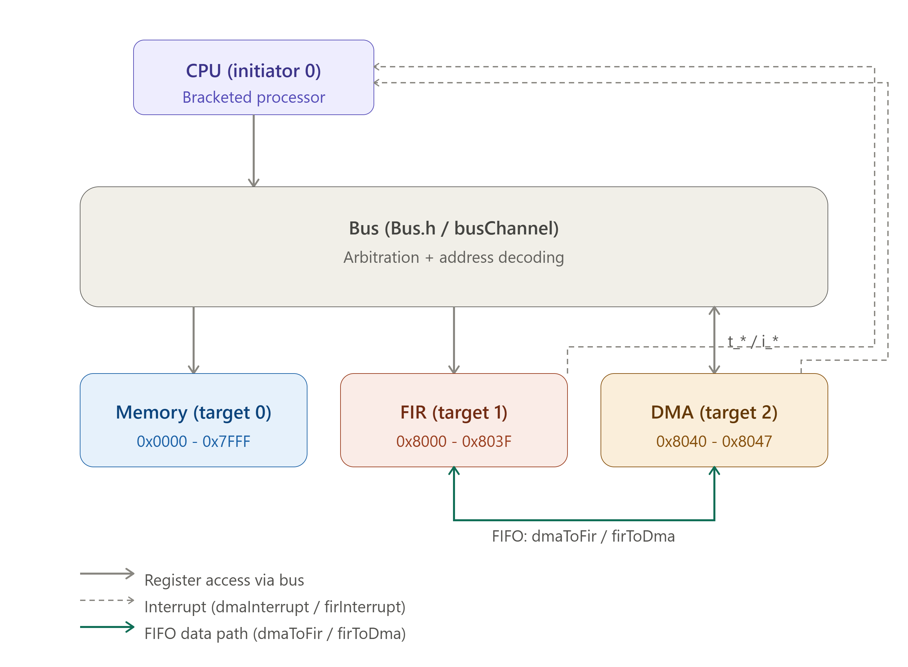

# Channel-Based FIR Filter SystemC

A SystemC-based FIR audio filter system with a channel-based bus layer and FIFO-based streaming path.

This repository contains the channelized version of the original wired SystemC design.

The key idea is to keep the core modules unchanged while replacing the original direct bus interconnect with:

- `busChannel` as the shared communication channel
- `Transactor` for bus masters
- `SlaveTransactor` for bus targets

This gives a cleaner architectural separation between:

- Control / register transactions
- Streaming sample movement
- CPU / DMA orchestration

---
## Diagram

## Architecture Overview

The top-level design is `EmbeddedSystemChannel<16>` in `SystemFilterChannel.h`.

It instantiates:

- `Processor<16>`
- `Memory<16>`
- `FIRAccelerator`
- `DMA_FIR`
- `busChannel`
- `Transactor`
- `SlaveTransactor`

The system is split into two communication domains:

### 1. Register / Control Path

Used for configuration and status polling.

This path connects:

- CPU -> FIR accelerator registers
- CPU -> DMA registers
- DMA -> memory via bus master access

### 2. Streaming Data Path

Used for sample movement through FIFOs.

This path connects:

- Memory -> DMA
- DMA -> FIR input FIFO
- FIR output FIFO -> DMA
- DMA -> Memory

The control path is memory-mapped over the bus.
The data path is FIFO-based and carries the actual audio samples.

---

## Repository Layout

~~~text
.
├── data/
│   └── raw/
│       ├── noisy.wav
│       ├── clean.wav
│       ├── noisy.txt
│       ├── clean.txt
│       └── coefficients.txt
├── include/
│   ├── busChannel.h
│   ├── Config.h
│   ├── FIRAccelerator.h
│   ├── interfaceClasses.h
│   ├── Memory.h
│   ├── ProcessorFilter.h
│   ├── SlaveTransactor.h
│   ├── SystemFilterChannel.h
│   └── Transactor.h
├── src/
│   ├── busChannel.cpp
│   ├── DMA_FIR.cpp
│   ├── main_filter_channel.cpp
│   ├── SlaveTransactor.cpp
│   └── Transactor.cpp
├── scripts/
│   ├── txt_to_wav.cpp
│   └── wav_to_txt.cpp
└── README.md
~~~

## Build Requirements

- **Compiler:** C++17 compliant (e.g., GCC 7+)
- **Library:** SystemC 2.3.x or newer
- **Environment:** Linux / WSL / Unix-like Shell

## Compilation & Execution

The project is built from the repository root.
Ensure your `$SYSTEMC_HOME` environment variable is set to your SystemC installation path.

### Build Command

~~~bash
g++ -std=c++17 \
    -Iinclude \
    -Isrc \
    -I$SYSTEMC_HOME/include \
    src/main_filter_channel.cpp \
    src/busChannel.cpp \
    src/Transactor.cpp \
    src/SlaveTransactor.cpp \
    -L$SYSTEMC_HOME/lib-linux64 \
    -lsystemc \
    -o filterchannel
~~~

### Run

~~~bash
./filterchannel
~~~

> **Note:** The `-Isrc` flag is required because `SystemFilterChannel.h` currently includes `DMA_FIR.cpp` directly.

---

## Address Map

The `busChannel` decodes three primary memory-mapped regions:

| Address Range | Target Device | Description |
|---------------|---------------|-------------|
| `0x0000 - 0x7FFF` | Memory | Main System Memory |
| `0x8000 - 0x803F` | FIR Accelerator | Filter Coefficients & Control |
| `0x8040 - 0x8047` | DMA Engine | DMA Configuration Registers |

## Register Definitions

### FIR Accelerator (Local Offsets)

- `0 ... TAPS-1`: Filter Coefficients (Q1.15)
- `TAPS`: Control Register (Start/Reset)
- `TAPS+1`: Status Register (Done Bit)

### DMA Engine (Local Offsets)

- `0`: Control (Bit 0: Enable)
- `1`: Source Address (Memory Read Start)
- `2`: Destination Address (Memory Write Start)
- `3`: Byte Count (Number of samples to process)
- `4`: Status (Bit 15: Interrupt/Done ACK)

---

## Data Flow Logic

1. **Initialization:** The testbench reads `noisy.txt` and `coefficients.txt` from `data/raw/` and initializes the SystemC Memory.
2. **Setup:** The CPU loads FIR coefficients and configures the DMA parameters.
3. **Processing:**
   - DMA reads block from Memory -> pushes to `dmaToFir` FIFO.
   - FIR Accelerator reads from FIFO -> processes samples -> pushes to `firToDma` FIFO.
   - DMA reads from `firToDma` -> writes back to Memory.
4. **Completion:** DMA raises an interrupt; CPU acknowledges and the simulation exports `clean.txt`.

---

## Debugging and Accuracy

- **Arithmetic:** The FIR filter uses Fixed-Point Q1.15 arithmetic.
- **Synchronization:** The system utilizes a handshake/interrupt mechanism. For reliable results, ensure the DMA status is acknowledged to clear stale interrupt levels before starting a new transaction.

---

## Utilities

Helper tools in `scripts/` can be used to convert raw audio files to the text format required by the simulation and vice versa.

---
## Course Information

| Field | Value |
|-------|-------|
| **Course** | `Object-Oriented Modeling of Electronic Circuits, Spring 1405 ` |
| **Professor** | `Dr. Navabi` |
| **University** | `UNIVERSITY OF TEHRAN - Electrical and Computer Engineering Department ` |

---

## License

MIT License

## Author

Fereshte Kambarani
